#  deeplearning.ai Course4 Week3笔记
@(吴恩达深度学习笔记)[卷积神经网络, 计算机视觉, 目标检测, Bounding Box, 交并比函数, 非极大值抑制, Anchor Boxes, YOLO, 候选区域]

-----

[TOC]

本周课程的学习内容是目标检测。
## 目标定位
考虑下面的图片
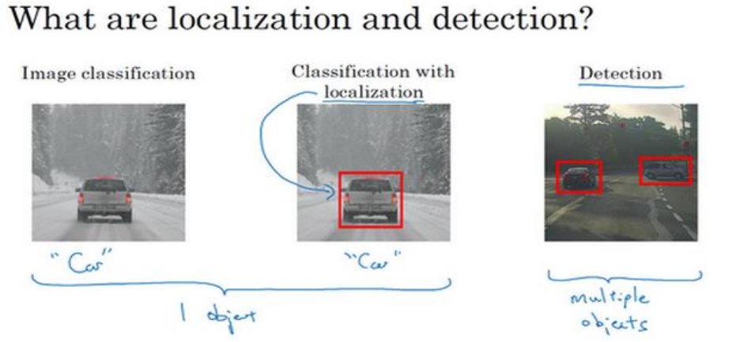
目标定位不仅需要判断出图片中是否含有汽车，还需要把汽车的位置确定出来。
这里，我们先考虑图片中只有一个需要我们检测的对象。因为一张图片中可能有多个需要检测的对象。

这里我们考虑一个自动驾驶系统，需要检测的对象包括行人，汽车，摩托车和背景（即不含有前面三种），那么我们需要一个softmax单元。为了确定出汽车的位置，我们需要多输出四个数字$b_{x}, b_{y}, b_{h}, b_{w}$，首先我们需要做一些符号假定。
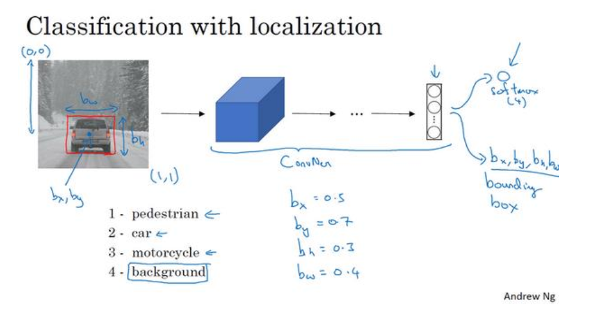
如图所示，我们假设图片左上角的坐标是$(0,0)$，右下角是$(1,1)$，$(b_x, b_y)$是汽车中心的位置坐标，$b_w$是汽车的宽度，$b_h$是汽车的高度，这样通过这四个参数，我们就可以确定出汽车的位置啦。

下面，我们考虑监督学习的标签，定义目标标签如下
$$y=\left[ \begin{array}{l}{p_{c}} \\ {b_{x}} \\ {b_{y}} \\ {b_{h}} \\ {b_{w}} \\ {c_{1}} \\ {c_{2}} \\ {c_{2}} \\ {c_{3}}\end{array}\right]$$
$p_c=1$表示图片中包含需要检测的对象，为0时候表示不包含需要检测的对象，
$p_c=1$时，后面的四个分量是对象的参数化表示，最后三个数字表示属于哪一类，是汽车，摩托车还是行人，是用1表示，不是用0表示，因为我们考虑的是最多只有一个对象，所以我们最多只有一个1。如果$p_c=0$,则后面的分量不予考虑。

最后考虑损失函数，这里我们采用平方损失，在实际中，我们可以对参数化表示使用平方损失，对$c_1,c_2,c_3$使用负对数似然，对$p_c$使用逻辑回归。
## 特征点检测
特征点检测是对物体的某些特征点的位置进行检测。比如下面的图片
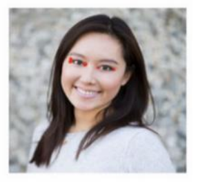
我们希望检测模特的眼角的位置。比如说检测左眼角，我们可以把在输出单元增加两个单元来保存眼角的二维坐标，同样，如果我们希望检测多个特征点，我们只需要增加对应的坐标到输出单元即可。比如说人脸检测中我们希望检测人脸的64个特征点，我们的输出单元就是1+64*2=129。
## 目标检测
下面介绍基于滑动窗口的目标检测算法。
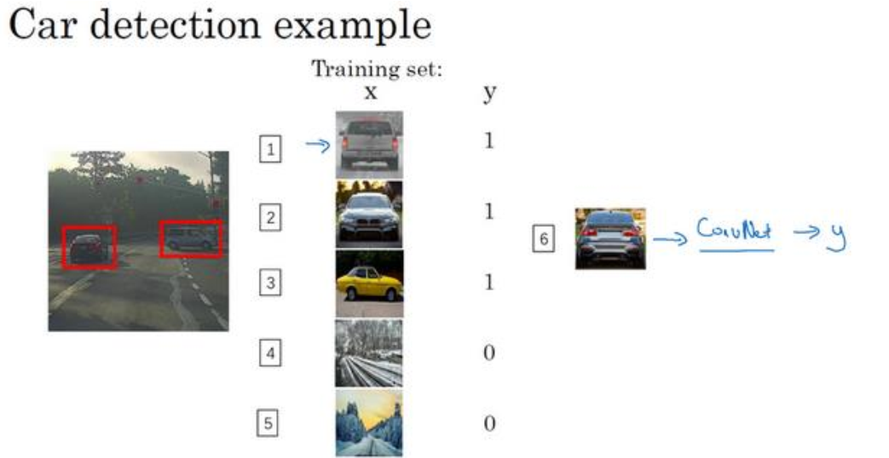
假设我们需要创建一个汽车检测算法，我们有训练集，首先，如果训练集中有汽车，那么我们对其进行裁剪，使得汽车位于图片中间，且基本占据了整张图片，把裁剪好的图片送入神经网络进行训练。训练完卷积网络以后，我们就可以用它来实现滑动窗口的目标检测。

具体步骤如下

考虑这样一个测试样本
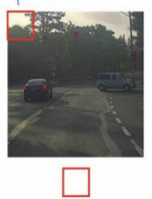
首先选择一个窗口，把裁剪的部分送入神经网络检测有木有汽车，然后红色区域移动检测第二个裁剪的部分，一直遍历完整个图片为止。这里我们选取的步幅较大，而且是以固定的步幅在移动。

然后，我们选取更大的区域来对图片进行裁剪，重复上面的操作。
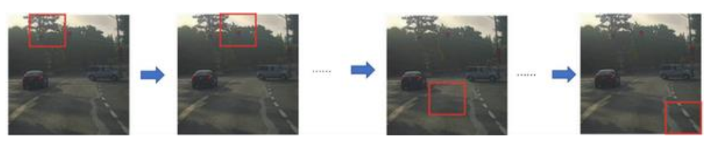
然后第三次重复操作，这次选用更大的窗口。
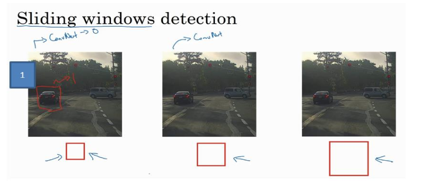
这样，无论汽车在哪个位置，我们总有一个窗口可以检测到它。

这种算法叫做滑动窗口的目标检测。

一个很大的缺点是计算成本很大，如果选用的步幅很大，显然会减少输入卷积网络的窗口个数，但是粗糙间隔尺寸可能会影响性能，反之，如果步幅很小，计算量会很大。
## 卷积的滑动窗口实现
下面介绍如何使用卷积实现滑动窗口的目标检测算法。

考虑下面一个CNN的网络
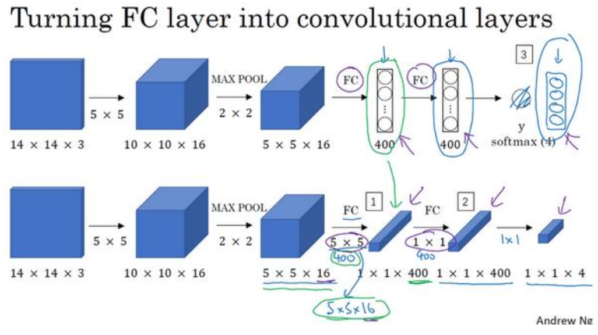
我们先介绍如何把全连接层转化成卷积层。

比如说对第一个全连接层，我们可以替换成$5\times5$的卷积层，通道数目是400。从数学的角度看，它和全连接层是一样的，因为400个节点的每一个节点都是前一层的元素的线性组合；同样的，第二个全连接层可以看成是$1\times1$的卷积层，通道数是400。最后是$1\times1$的卷积层，通道数是4，是一个softmax层。

下面我们介绍如何用卷积实现滑动窗口的目标检测算法，如图
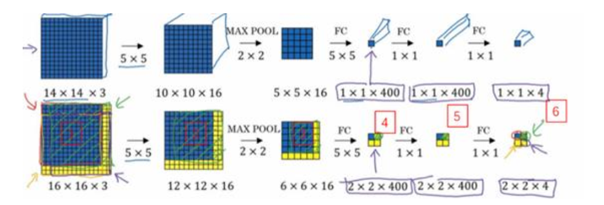
假设我们的输入是$14\times14\times3$,输出是$16\times16\times3$，如果用前面介绍的滑动窗口算法，我们需要执行四次，而且有很多重复计算的步骤。利用卷积，我们可以对整张图片做一次前向传播，全连接层输出的是$2\times2$，分别代表不同的区域。

而且对于其他的更大的图片，我们同样可以操作。如$28\times28\times3$的图片，我们以步长为2来移动，则可以得到
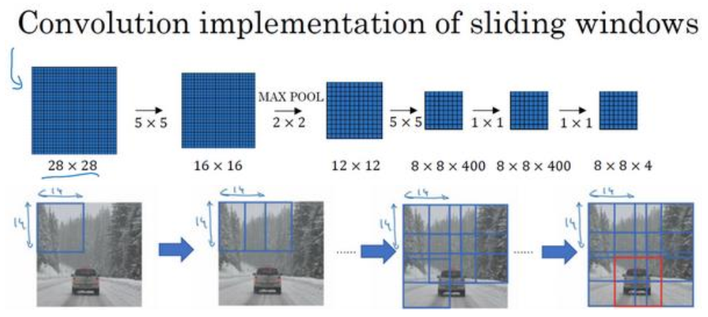
输出的是$8\times8\times4$。
在卷积层上使用滑动窗口算法可以提高效率，一个缺点是边界框位置可能不准确。
## Bounding Box预测
滑动窗口的卷积实现是一个非常高效的算法，这个算法的一个缺点是不能输出最精确的边框。比如在这幅图片中，我们不知道哪一个是最精确的。
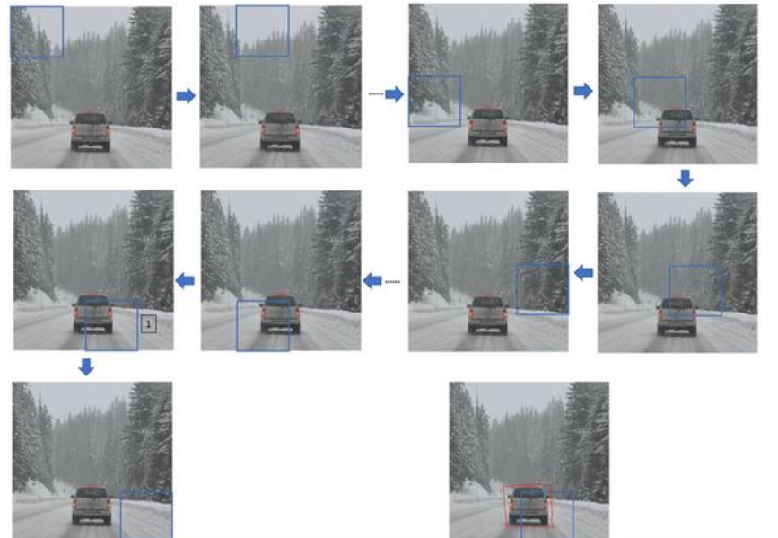
解决这个问题的一个办法是YOLO算法。具体步骤如下

假设我们的图片大小是$100\times100$，我们使用一个网格，如$3\times3$的（实际中可能使用更精细的网格，如$19\times19$），对每个网格执行我们第一节讲的预测，则每个网格会输出一个8个分量的向量。
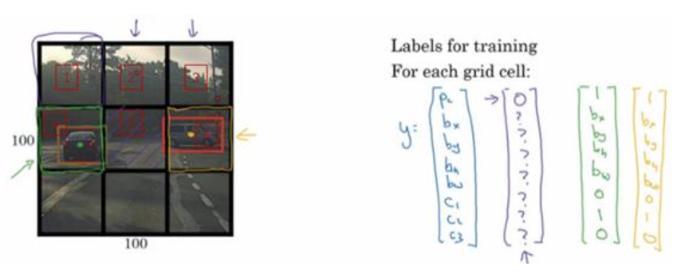
比如第一个网格的输出向量是
$$y=\left[ \begin{array}{l}{0} \\ {?} \\ {?} \\ {?} \\ {?} \\ {?} \\ {?}\end{array}\right]$$
而第四个格子的输出为
$$y=\left[ \begin{array}{c}{1} \\ {b_{x}} \\ {b_{y}} \\ {b_{h}} \\ {b_{w}} \\ {0} \\ {1} \\ {0}\end{array}\right]$$
最后三个分量分别代表行人，汽车和摩托车，因为我们的网格只包含汽车，所以只有倒数第二个分量是1.同样网格6也是类似的。对于这张图片，我们有两个对象，YOLO算法的做法是，取两个对象的中点，把两个对象分配给只包含对象中点的格子，即格子4和格子6，虽然格子5包含了对象的一部分，但是输出仍然是与第一个网格一样。所以这个网络的最终输出是$3\times3\times8$的张量。

所以这个算法可以很精确地输出边框，这里我们讨论的是一个网格只包含一个对象的情况，可能会存在一个网格包含多个对象的情况。但是在实践中，我们会用到更精细的$19\times19$的网格，这样网络的输出就

是$19\times19\times8$的，多个对象分配到一个格子的概率会小得多。
这个算法同样采用的是卷积实现，共享了很多计算步骤，所以也是一个非常高效的算法。这也是YOLO算法受欢迎的一个原因。

还有一个细节就是再给出对象的参数化表示的时候，我们是相对于网格来确定参数的，所以$b_x, b_y$都是在0,1之间的。在YOLO的研究论文中，给出了几种不同的参数化表示，但是这是一种比较合理的表示。
## 交并比函数
下面我们介绍用交并比函数来判断对象检测算法是否运作良好。
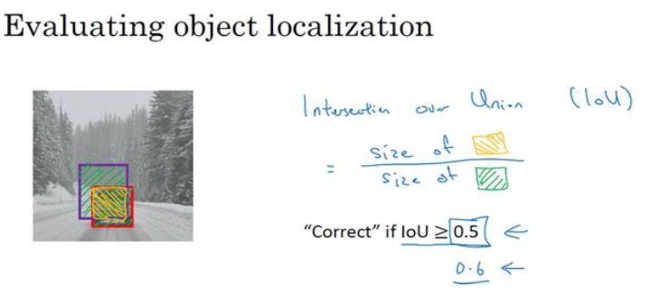

如图，假设对象实际的边框是紫色边框，算法给出的边框是红色边框，定义交并比函数IoU为二者交集的面积与并集的面积的比值，比如我们可以认为比值大于0.5时算法运作良好。在实际中，这个阈值通常设为更高，比如0.6或0.7。
## 非极大值抑制
非极大值抑制解决的是对同一个物体进行多次检测的问题。以下图为例
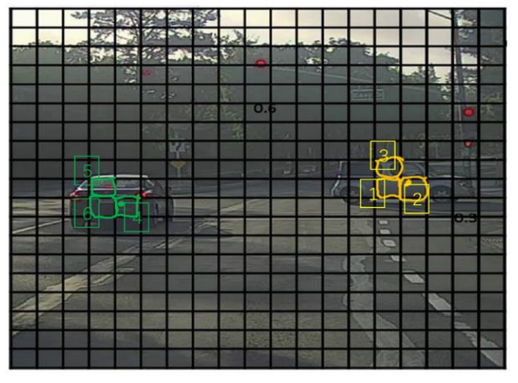
对于这样一个$19\times19$的网格，可能对同一个物体有多个检测结果，比如1， 2， 3的框都认为右边的车的中心在自己这里。非极大值抑制解决的就是这个问题。

首先，非极大值抑制算法收集到所有的有对象集合，先把其中概率最大的挑出来，这里的概率实际上是$p_c$乘以$c_1,c_2$或$c_3$，然后把剩余集合中与该格子的交并比大于某个阈值的格子去掉，因为他们可能检测的是同一个物体，然后再在剩余的集合中重复上述的步骤，一直到两两的交并比都比较小位置，这样我们认为算法检测出多个物体，且没有重复的检测。
算法的具体步骤是先对$19\times19$的网格做一次前向传播，先把概率小于某个阈值（如0.6）网格去掉，然后再在剩下的网格里面跳出一个概率最大的，按照前面的办法去掉交并比比较大的，不断循环这个过程。
##Anchor Boxes
Anchor Boxes解决的是同一个网格中出现两个对象的问题。如下面的图片

任何汽车出现在同一个格子里面，而输出只能检测一个对象。

Anchor Box的做法是预定义两个anchor
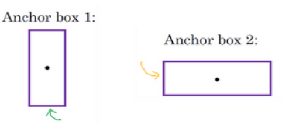
比如说我们可以用第一个来代替人，第二个来代替车，这是我们的输出标签也重复两次。
$$y=\left[ \begin{array}{lllllllllllllll}{p_{c}} & {b_{x}} & {b_{y}} & {b_{h}} & {b_{w}} & {c_{1}} & {c_{2}} & {c_{3}} & {p_{c}} & {b_{x}} & {b_{y}} & {b_{h}} & {b_{w}} & {c_{1}} & {c_{2}} & {c_{3}}\end{array}\right]^{T}$$
前面8个分量来检测第一个anchor，后面8个分量来检测第二个分量。比如在上面的图片中，第一个anchor编码$c_1=1,c_2=0,c_3=0$，第二个anchor编码$c_1=0,c_2=1,c_3=0$。

现在每个对象都和之前一样分配到同一个格子中，分配到对象中点所在的格子中，以及分配到和对象形状交并比最高的 anchor box中。比如说人和第一个anchor的交并比更高，所以分配给第一个anchor。所以对于$3\times3$的网格，输出是$3\times3\times16$或者说是$3\times3\times2\times8$.如果anchor数目增加的话，那个输出维度也会随之增大。

当然，如果网格只有一个对象，比如说人走开了，那么对应的anchor的$p_c=0$，剩下的七个分量是？。

对于以下的情况，anchor boxes是需要引入其他的方法的：一是一个网格里面包含了不只是两个对象，二是两个对象很像同一个anchor。比如说图片中出现两个站在一起的人，他们都和第一个anchor很像。这种情况出现的不多，所以对性能的影响不是很大。

建立anchor boxes的概念，是为了处理一个网格出现多个对象的情况，实际情况出现的不多，特别是当我们选择比较精细的网格的时候。

对anchor的选取，可以是人工指定，选取5到10个anchor，也可以使用更加高级的方法，比如说k-均值聚类。

##YOLO算法
把前面的知识组合起来就得到了我们的YOLO算法。

我们假设使用$3\times3$的网格，anchor数是2，那么我们的输出是$3\times3\times2\times8$的。在做预测的时候，如果我们的anchor没有检测出对象，那么剩下的几个分量是？。但是在操作时，神经网络不能输出？，所以把第一个分量输出是0.剩下的分量输出一些数字，但是网络会忽略掉，因为这些可以看成是噪音。反之，如果anchor检测除了对象，那么我们希望可以把边界也输出来，剩下的分量就是输出边界的参数化表示和类别。

最后我们需要做非极大值抑制，我们可以先去掉一些没有任何对象的网格，然后我们需要对每一个对象都做一次，比如说我们需要检测三个对象，那么我们需要对这三个对象分别做一次非极大值抑制。

这就是 YOLO 对象检测算法，这实际上是最有效的对象检测算法之一，包含了整个计算机视觉对象检测领域文献中很多最精妙的思路。

##候选区域
滑动窗口算法的一个缺点是会在没有任何对象的区域浪费时间。比如下图
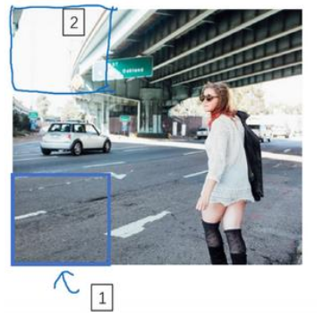
区域1和区域2都没有任何对象，但是我们的算法依然会去检测。
候选区域就是在少数的区域来运行卷积网络分类器。确定候选区域的办法一般是图像分割里的算法，比如说我们检测处如下的色块
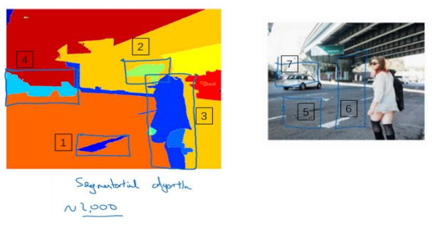
我们就可以在某个色块上运行卷积网络。

所以这个细节就是所谓的分割算法，你先找出可能 2000 多个色块，然后在这 2000 个色块上放置边界框，然后在这 2000 个色块上运行分类器，这样需要处理的位置可能要少的多，可以减少卷积网络分类器运行时间，比在图像所有位置运行一遍分类器要快。

这就是 R-CNN 或者区域 CNN 的特色概念，现在 R-CNN算法的一个缺点是太慢了，所以这些年来有一些对 R-CNN算法的改进工作，Ross Girshik 提出了 Fast R-CNN 算法，它基本上是 R-CNN 算法，不过用卷积实现了滑动窗法。最初的算法是逐一对区域分类的，所以 Fast R-CNN 用的是滑动窗法的一个卷积实现。

Fast R-CNN 算法的其中一个问题是得到候选区域的聚类步骤仍然非常缓慢，更快的Faster R-CNN使用的是卷积神经网络，而不是更传统的分割算法来获得候选区域色块，结果比 Fast R-CNN 算法快得多。不过仍然比YOLO算法慢。