#  deeplearning.ai Course4 Week1笔记
## 计算机视觉
计算机视觉的应用：图片分类（比如可以建一个识别猫的分类器），目标检测（可以用于自动驾驶），也可以把不同的艺术风格混合在一起创造新的艺术形式。
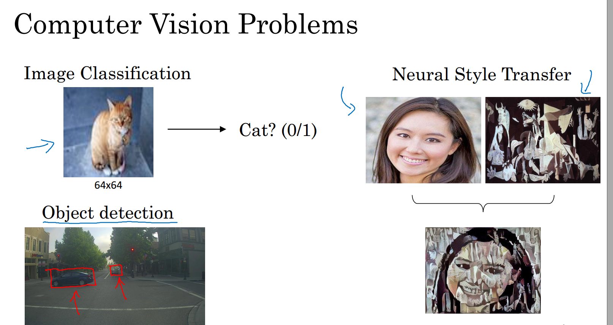
计算机视觉所面临的挑战主要是输入数据的维度很高。比如$64\times64$的RGB图像，输入数据的维度是12288维，而$64\times64$显然是分辨率不高的图像，分别率高图像如$1000\times1000$的RGB图像，数据的输入维度高达300万，如果我们使用全连接神经网络，隐藏层设置1000个神经元，那么我们需要拟合30亿个参数！显然是非常庞大的。 这带来两个主要的问题，一个是我们没有足够的数据去避免过拟合，另外一个是处理大量的数据对计算机的配置要求很高。
## 边缘检测
通过边缘检测，我们可以了解到卷积是如何工作的。
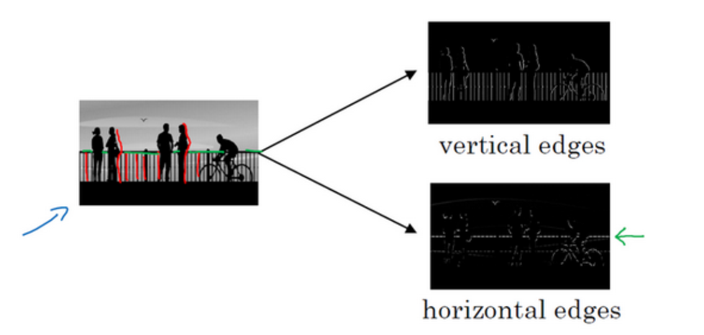
对于左边的图片，边缘检测的任务是识别出左边图像的水平边缘和垂直边缘，如右图所示。

我们以下图为例来具体说明卷积运算

我们这里假设对一个~$6\times6$的灰度图像做卷积，左边是图像的矩阵，右边的矩阵称为一个滤镜，在有些文献中也叫作核。两个矩阵卷积后的结果是一个$4\times4$的矩阵，其中矩阵的（1,1）元素是图像左上角的$3\times3$矩阵和滤镜对应元素相乘再相加。（1,2）元素是把左上角的$3\times3$矩阵向右移动一格，得到的新的$3\times3$子矩阵和滤镜对应元素相乘再相加。再向右移动可以依次得到（1,3）和（1,4）的值。同样（2,1）是把左上角的子矩阵向下移动一格。按照这种方式，最终我们得到的输出是一个$4\times4$的矩阵。在TensorFlow中，卷积运算是tf.conv2d。
上图中的滤镜做的是垂直边缘检测。如下图所示
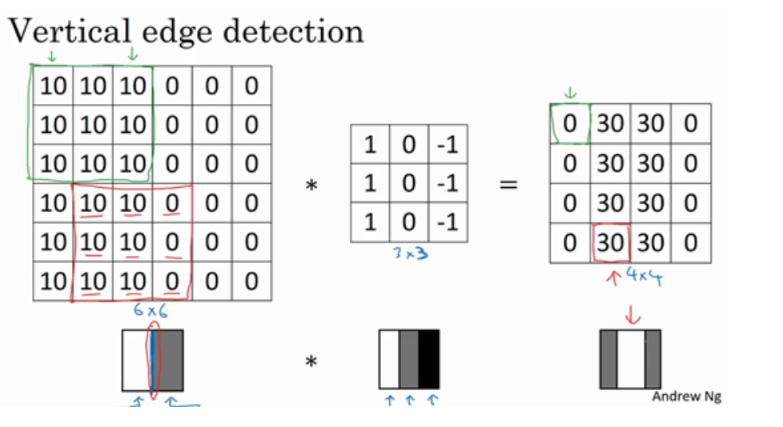
左边的图像和这个滤镜做卷积运算后，得到的新的图像的白色区域就是原来图像的垂直边界。显然，这个边缘太粗了，这是因为我们的像素不够，如果我们使用的是$1000\times1000$的图像，我们就可以很好的检测到边界。
下面，我们改变图片，看看滤镜会带来什么效果
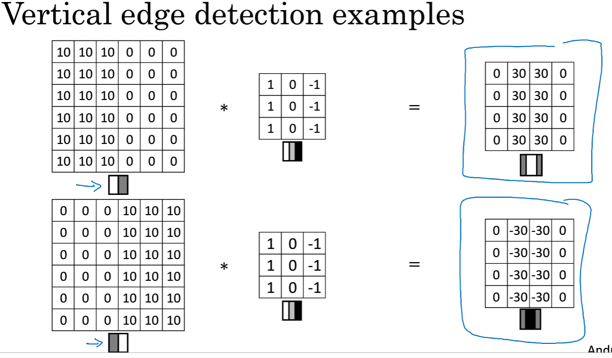
上面显示了两幅图片，第一幅图片左明右暗，卷积后从左到右是由暗变明，第二幅图片是左暗右明，卷积后的效果是由明变暗。显然如果取绝对值的话，这种效果就一样了，但是卷积确实可以做到这种效果。
上面我们说的滤镜做的是垂直边缘检测，把滤镜顺时针旋转90度，我们就可以得到水平边缘检测器。
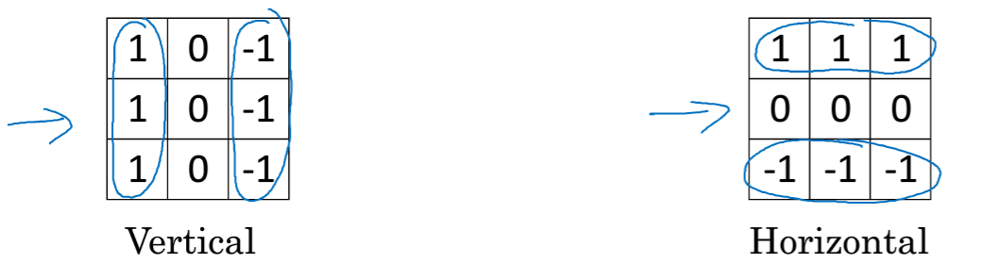
考虑一个更复杂的图片，看看用水平边缘检测器的效果
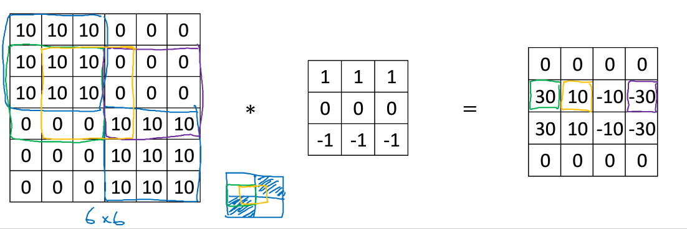
上面的图片右上角是比较暗的地方，和水平滤镜做卷积后，结果是右边的矩阵。这里的30（绿色方框）代表的是代表左边的$3\times3$区域，上面比较亮，下面比较暗，检测到一个正边界。而紫色方框的数是30，代表的是上面比较暗，下面比较亮，是一个负边界。黄色区域框住的部分是10，它所代表的区域左上角的$2\times2$和右下角$1\times1$是亮的区域，剩下的是暗的区域。得到的是一个中间值是10。但是如果是非常大的$1000\times1000$的图像，就不会有这种10的过渡带了。因为这时候的中间值都非常小。
在计算机视觉发展中，曾经讨论过怎样设置滤镜里的数字，比如有下面的Sobel滤镜和Scharr滤镜。
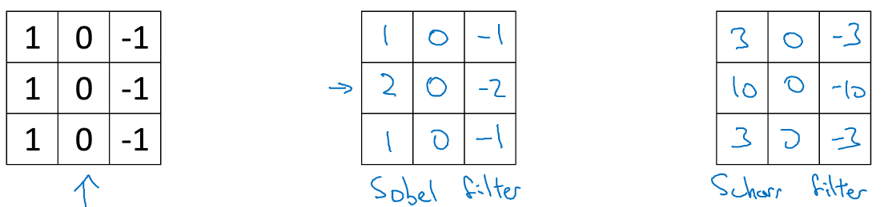
在Sobel滤镜中，我们给予了中间部位更大的权重。
不过在深度学习中，一个更好的方法是把滤镜里的元素看成是参数，用反向传播算法去学习。
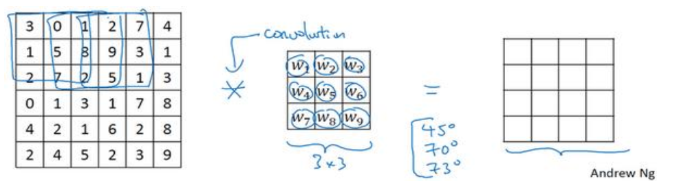
这种方法胜过人工选择滤镜，可以自动地学习到最佳的滤镜。不仅如此，不仅仅是水平边缘和垂直边缘，通过将滤镜设置为参数，我们可以学习到任意角度的滤镜。
## Padding
在构建卷积神经网络时，padding是一个基本的卷积操作。我们假设有一张$n\times n$的图片，使用的滤镜大小是$f\times f$，那么可以证明输出的图像大小是$(n-f+1)\times (n-f+1)$，这有两个缺点：
$\bullet$ 图片在做卷积时会不断缩小，特别是构建深度很大的神经网络时候，图片会变得越来越小。
$\bullet$ 在做卷积时，对边缘的信息利用不足，如左上角的元素只利用了一次。
padding就是为了解决上面两个问题，我们以前面的例子来说明padding。
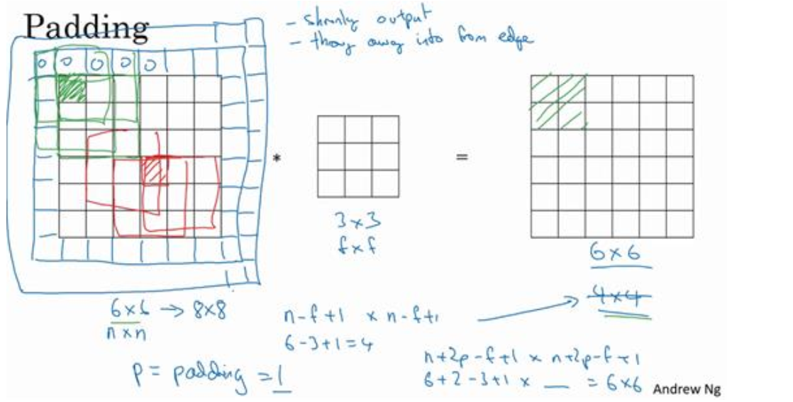
对于$6\times6$的原始图像，我们向边缘外填充一层像素，外面的原始全部设为0，这样经过卷积运算，我们输出的图像仍然是$6\times 6$的。我们用$p$代表填充的数量，在这个例子中，$p=1$。一般地，对于一个$p$，得到的图像大小是$(n +2p-f+1)\times(n+2p-f+1)$。
以上我们选取的是一个像素点来填充，我们也可以选择其他的$p$值。
对于p的选取，通常有Valid卷积和Same卷积两种。
$\bullet$Valid卷积意味着不填充，这样图片做完卷积后就会缩小
$\bullet$Same卷积要求输出的图像大小要和原来的一致
使用Same填充，意味着$n+2p-f+1=n$，即$p=\frac{f-1}{2}$。一般，我们选取的$f$都是奇数。原因有两点
$\bullet$在Same填充中，只有$f$是奇数才会有自然的填充，否则在偶数情况下，填充是不对称的。
$\bullet$$f$是奇数时，会有一个中心点，在计算机视觉中，有一个中心点方便找出过滤器的位置。
## 卷积步长（Strided Convolutions）
在构建卷积神经网络时，卷积步长是另一个基本操作。
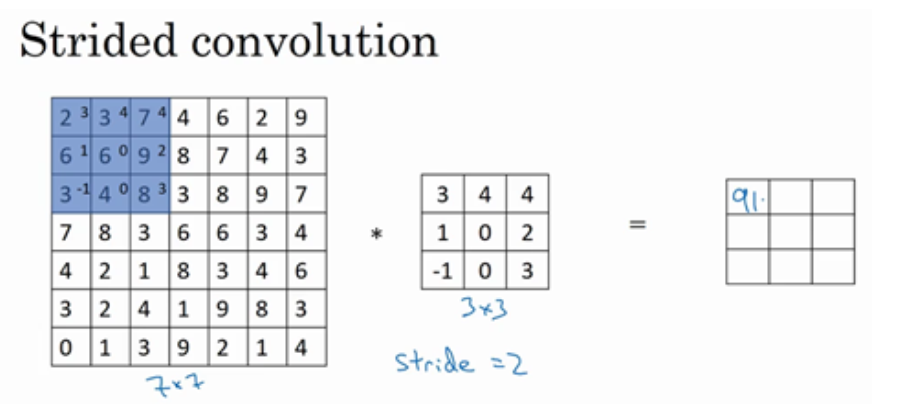
我们假设图片大小是$7\times7$，滤镜大小是$3\times3$，做一次卷积操作，不同的是，这次我们假设每一次移动的步长是2，那么我们最终会得到的输出是$3\times 3$的。
一般地，如果我们图像的大小是$n\times n$，滤镜大小是$f\times f$，padding是$p$，步长$s=2$，那么我们得到的图像大小是$(\frac{n+2p-f}{s}+1)\times (\frac{n + 2p-f}{s}+1)$。如果上不是一个整数的话，通常是向下取整。蓝色部分如果移动到了外面，就不要进行乘法操作。
视频中还提到了数学中的卷积和信号处理中卷积的区别，在数学中，卷积需要先对滤镜进行左右和上下翻转，再进行乘法。而在信号处理和深度学习文献中的卷积是没有翻转的操作的，这里的卷积运算在数学书上称为互相关（cross-correlation）。在数学中，添加了翻转运算可以使得卷积操作满足结合律。即$(A*B)*C=A*(B*C)$。
## 三维卷积
为了对三维RGB图像做卷积，我们需要三维的过滤器。如对于一个$6\times6\times3$的图像，其中3代表的是通道数。我们可以使用$3\times3\times3$的滤镜。
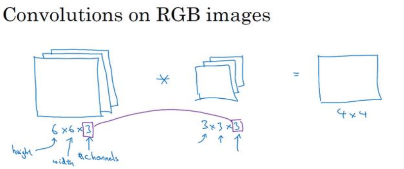
但是要注意，它的输出仍然是$4\times4$的，通道数为1。具体做法如下图
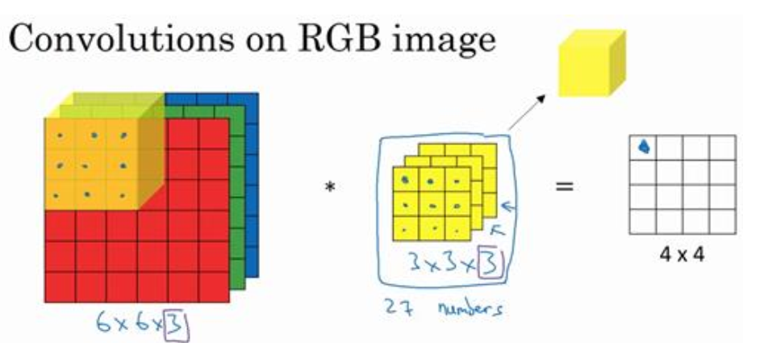
先把过滤器移动到图像的左上角的$3\times3\times3$处，和图像对应元素相乘，再把相乘后的27个数相加得到输出的（1,1），再把过滤器向右移动一格，对应元素相乘再相加，得到输出的（1,2），用类似的方法分别向下和向右移动，就可以得到$4\times4$的输出。
对于三维图像的卷积，如果我们只想检测红色通道的边缘，我们可以把绿色和蓝色通道的$3\times3$矩阵设置为
$$
 \left[
\begin{matrix}
0 & 0 &0\\
0 & 0 & 0\\
0 & 0  & 0
\end{matrix}
\right]
$$
把红色通道设置为
$$
\left[
\begin{matrix}
1 & 0 & -1\\
1 & 0 & -1\\
1 & 0 & -1
\end{matrix}
\right]
$$
那么这就是一个检测垂直边界的过滤器，而且只对红色通道有用。
如果我们不关心垂直边界在哪个通道里面，我们可以把过滤器三个通道的矩阵都设置为
$$
\left[
\begin{matrix}
1 & 0 & -1\\
1 & 0 & -1\\
1 & 0 & -1
\end{matrix}
\right]
$$
如果我们要检测多个方向的边缘，我们可以让同一张图片和不同的过滤器做卷积。如下图所示
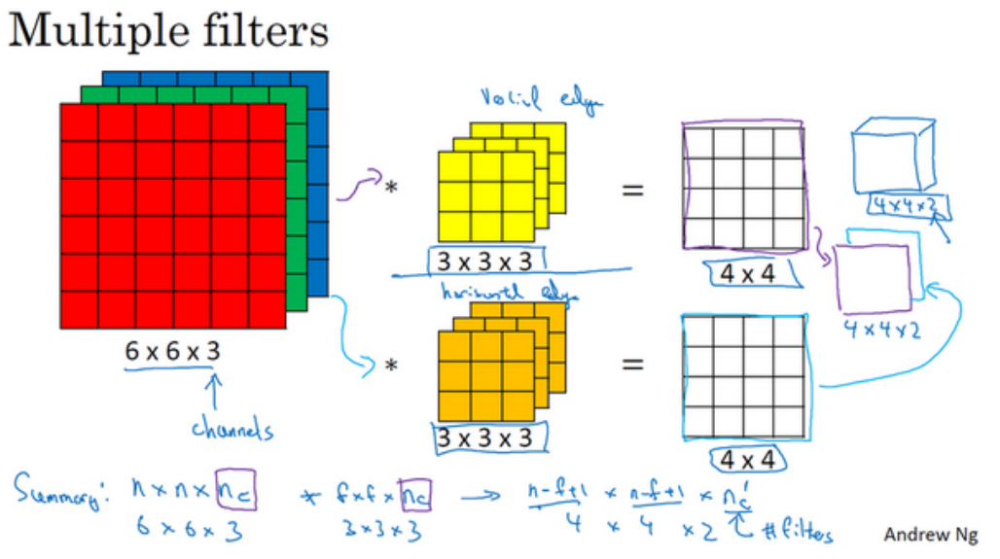
我们把图像和第一个过滤器做卷积，得到一个输出。然后和第二个过滤器卷积得到第二个输出，再把这两个输出堆叠在一起，形成一个$4\times4\times2$的立方体，这里的2是因为我们使用了2个不同的过滤器。
总结一下维度，如果有一个$n\times n\times n_c$的图像，其中$n_c$是通道数，过滤器是$f\times f\times n_c$的，两个$n_c$必须一致，那么输出的维数是$(n-f+1)\times(n-f+1)\times n_{c'}$，这里的$n_{c'}$是下一层的通道数，也就是使用的过滤器的个数。这里我们是假设步长为1且没有使用padding，如果考虑步长和padding，结果和前面一样。
在有些文献中把$n_c$叫做深度，但是在本课程中我们称它为通道数，以免和神经网络的深度冲突。
## 单层卷积网络
有了上面的知识，我们可以着手搭建一个简单的单层卷积网络。完整的过程如下
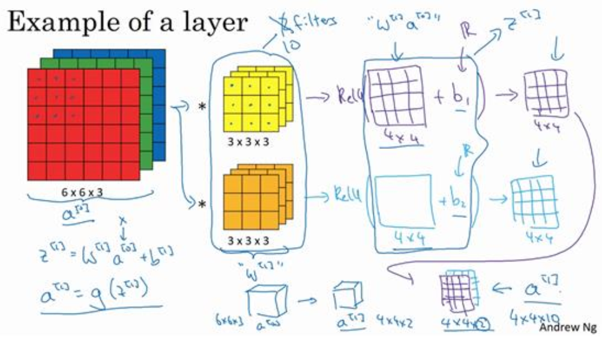
对上图，我们使用两个滤镜做卷积得到两个$4\times4$的矩阵，然后我们利用python的广播机制给每一个矩阵分别加上一个偏置$b_1$和$b_2$，在用一个非线性的激活函数如relu函数去作用，再把作用后的两个矩阵堆叠起来，最终就得到了卷积层的输出，它的大小是$4\times4\times2$。这就构成了卷积神经网络的一层。
注意，在前向传播的过程中，我们有
$$z^{[1]}=W^{[1]}a^{[0]}+b^{[1]}, a^{1}=g(z^{[1]})$$
在这里，输入$a^{[0]}$就相当于我们的图像，而滤镜的作用与$W^{[1]}$的作用类似。卷积操作输出的结果相当于$W^{[1]}a{[0]}$，$z^{[1]}$就相当于我们加上偏置后的矩阵，$a^{[1]}$就是我们卷积层的最终输出。这里我们选取的非线性激活函数$g$是relu函数。
图中，我们有两个过滤器，也就是两个特征，如果我们有10个特征，那么我们最终输出的大小是$4\times4\times10$。
假设我们有10个过滤器，那么我们可以计算一个卷积层的参数是滤镜的参数加上偏置，即$3\times3\times3\times10+10=280$。而且我们可以看到这个数字和输入的图像的大小是没有关系的，无论是$6\times6\times6$还是$1000\times1000\times1000$，一个卷积层的参数个数都是280个。这是卷积神经网络的一个特征，叫做“**避免过拟合**”
最后总结一下一个卷积层的参数（以$l$层为例）
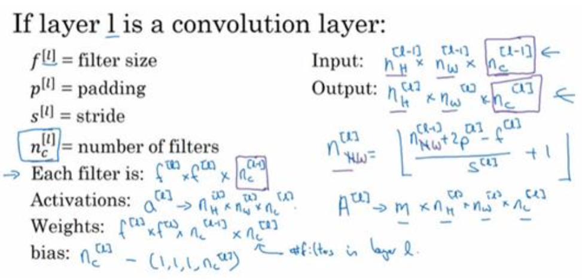
$f^{[l]}$滤镜大小
$p^{[l]}$padding
$s^{[l]}$步长
$n_c^{[l]}$滤镜个数
输入是$n_H^{[l-1]}\times n_W^{[l-1]}\times n_c^{[l-1]}$，在前面的例子中，图片的高度和宽度是一样的，实际操作中的宽度和高度可能不一样，所以我们用$n_H^{[l-1]}$和$n_W^{[l-1]}$来分别表示。同样，输出大小是$n_{H}^{[l]} \times n_{W}^{[l]} \times n_{c}^{[l]}$，根据前面的公式，我们可以知道$n_{H}^{[l]}=\left\lfloor\frac{n_{H}^{[l-1]}+2 p^{[l]_{-} f[l]}}{s^{[l]}}+1\right\rfloor$，$n_{W}^{[l]}=\left\lfloor\frac{n_{W}^{[l-1]}+2 p^{[l]_{-f}[l]}}{s^{[l]}}+1\right\rfloor$，输出也有通道数。第$l$层的通道数就是上一层的滤镜个数$n_c^{[l]}$。
如果我们使用向量化，一次训练$m$张图片，那么输出的大小就是$$A^{[l]}=m \times n_{H}^{[l]} \times n_{W}^{[l]} \times n_{c}^{[l]}$$
过滤器的参数个数是$f^{[l]} \times f^{[l]} \times n_{c}^{[l-1]} \times n_{c}^{[l]}$
偏置的个数是$n_{c}^{[l]}$个，在一些文献和GitHub的开源代码中，会把通道数放在前面，没有统一的标记。课程中的通道数在后面。
## 简单卷积网络示例
我们以猫分类器为例，来建立一个简单的卷积神经网络，这里，我们的输入是$39 \times 39 \times 3$，具体的网络如下
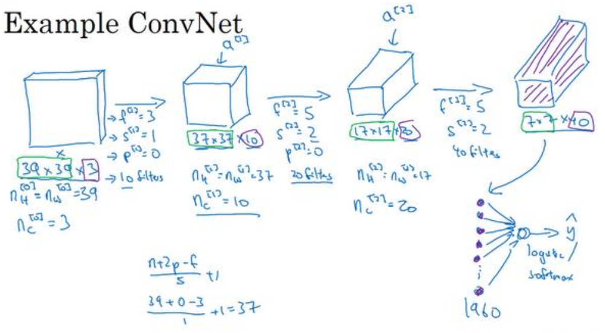
第一个卷积层，我们使用的滤镜大小是$3\times3$，步长为1，使用valid卷积，滤镜个数是10，卷积后输出是$37times37\times10$，其中37可以由公式计算得到；第二个卷积层，我们使用$5\times5$的滤镜，步长是2，仍然使用valid卷积，滤镜个数是20，得到的输出是$17 \times 17 \times 20$，第三个卷积层我们使用$5\times5$的滤镜，步长为2，padding仍然为0，滤镜个数是40，得到输出的大小是$7 \times 7 \times 40$。再把输出的结果拉成一个长向量，送入logstic或者是softmax层做预测。
可以看出，随着网络的不断加深，图片大小在不断减小，通道数在不断增加。
一个卷积神经网络通常还包括池化层和全连接层。
##池化层
卷积网络也经常使用池化层来缩减模型的大小，提高计算速度，同时提高
所提取特征的鲁棒性
先讲一个最大池化（Max Pooling）的例子，如下图所示
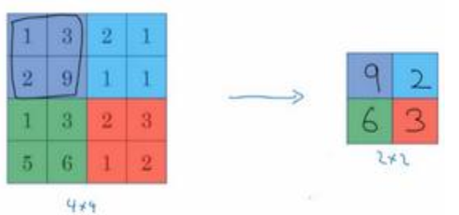
对一个$4\times4$矩阵做最大池化就是把它分成4个$2\times2$的子矩阵，再把每个子矩阵的最大值拿出来组成一个新的$2\times3$的矩阵。
如对左上角的第一个子矩阵，最大值是9，所以（1,1）的元素就是9。在向右移动两格，继续上面的操作。所以该过滤器的大小是$2\times2$，步长$s=2$。
对池化的理解可以是认为原矩阵是一个特征的集合，数字大意味着可能探测到了某些特定的特征。最大化操作的功能就是只要在任何一个象限内提取到某个特征，它都会保留在最大化的池化输出里。所以最大化运算的实际作用就是，如果在过滤器中提取到某个特征，那么保留其最大值。如果没有提取到这个特征，
可能在右上象限中不存在这个特征，那么其中的最大值也还是很小，这就是最大池化的直观理解。
池化的一个特点是没有任何参数需要学习，需要调整的是一些超参数而已。
我们假设图像的大小是$5\times5$，设置超参数$f=3,s=1$，那么我们的输出就是就是$3\times3$的。前面计算卷积层大小的公式同样适用于池化层。如果有$n_c$个通道，那么池化层会对每一个通道单独做池化，输出就是$5\times5\times n_c$。
另一种池化操作是平均池化，就是把取最大值的操作改成求平均值，不过，在神经网络中，最大池化比平均池化用的更多。
在池化层很少用padding，所以一般$p=0$。所以最大池化的输入是$n_{H} \times n_{W} \times n_{c}$，假设没有padding，输出大小是$$\left\lfloor\frac{n_{H}-f}{s}+\right.1 \rfloor \times\left\lfloor\frac{n_{w}-f}{s}+1\right\rfloor \times n_{c}$$
## 卷积神经网络示例
我们以$32\times32\times3$的图片为例，来搭建一个完整的卷积神经网络。该网络灵感来源于经典的LeNet-5，许多的参数选择都与其相似。如图
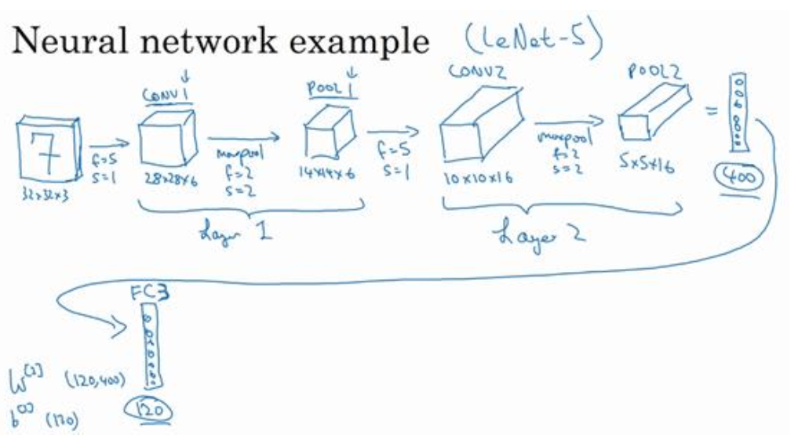
输入是 32×32×3 的矩阵，首先是一个卷积层，使用过滤器大小为 5×5，步幅是 1，padding是 0，过滤器个数为 6，那么输出为 28×28×6。使用的激活函数是relu，将这层标记为 CONV1；然后是一个最大池化层，$f=2,s=2$，这样，图片高度和宽度会减小一半，通道数不变，输出是$14\times14\times6$，把这一层称为POOL1，这里我们把CONV1和POOL1合称为Layer1，有些地方把这两层单独称为两个layer，在计算神经网络时层数，只统计有权重和参数的层，而池化层只有超参数，所以我们把池化层合称为Layer1。所以经过Layer1，得到的输出是$14\times14\times6$
然后在建立一个卷积层，过滤器是$5\times5$，步长是1，滤镜个数是16，得到的输出是$10\times10\times16$，记为CONV2，然后做最大池化，超参数$f=2,s=2$，输出是$5\times5\times16$，把这一层记为POOL2，同样把CONV2和POOL2合称为Layer2，所以经过Layer2，输出为$5\times5\times16$。
再把$5\times5\times16$的矩阵平整成400维的向量，和一个120个神经元的隐藏层做全连接，权重矩阵是$W^{[3]}$，矩阵大小是$120\times400$，这就是所谓的全连接，这是我们第一个全连接层，记为FC3，再连接到一个84个神经元的隐藏层，这是我们第二个全连接层，记为FC4，最后用这84个单元填充一个softmax层，如果我们想识别0-9的手写数字，那么这个softmax层就有10个输出
对于超参数的选择，一个常规做法是参考其他人的文献。
随着网络深度的增加，高度和宽度一般会减小，而通道的数目会增加。
另一种常见的网络结构是一个或多个卷积层后跟一个池化层，然后一个或多个卷积层后再跟一个池化层，然后再跟几个全连接层，在接上一个softmax层作为输出。
该网络的参数归纳如下
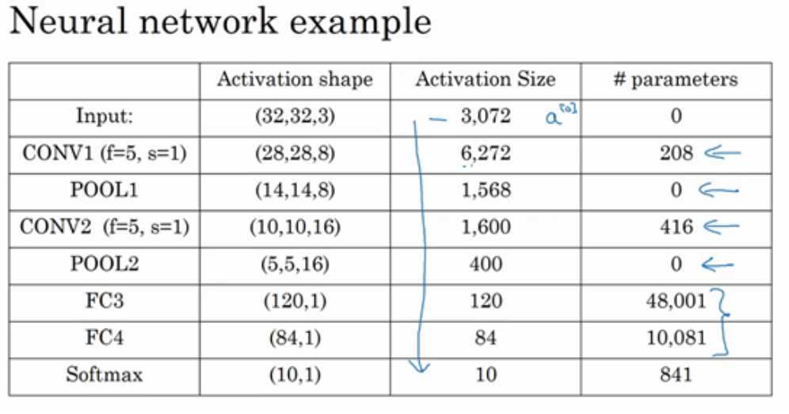
需要注意以下几点
$\bullet$池化层没有参数
$\bullet$卷积层的参数比较小，大量的参数都在全连接层
$\bullet$随着网络的加深，激活值的尺寸在变小，如果尺寸下降的太快，会影响网络的性能。示例中，激活值尺寸在第一层为 6000，然后减少到 1600，慢慢减少到 84，最后输出 softmax结果。我们发现，许多卷积网络都具有这些属性，模式上也相似。
## 为什么要使用卷积
卷积层的主要优势在于参数共享和系数连接
参数共享就是特征检测如垂直边缘检测如果适用于图片的某个区域，那么也适用于其他区域
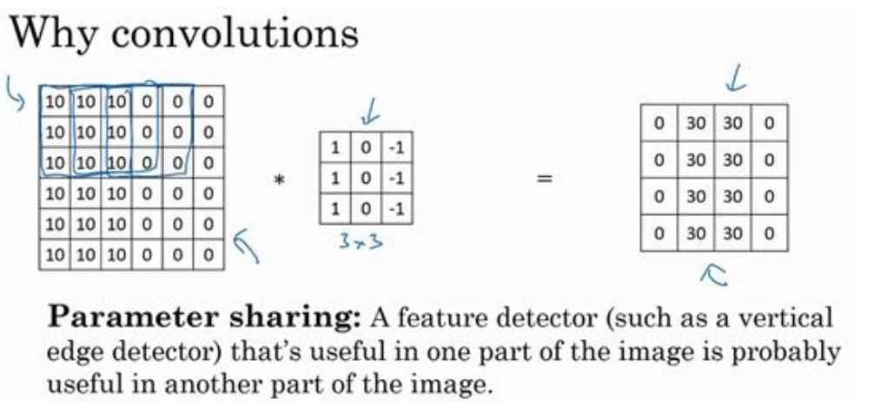
如上图，不同的$3\times3$区域用的是同一组参数
稀疏连接的意思是对某一个区域做卷积时，其他区域对它没有影响。
神经网络可以通过这两种机制减少参数，以便我们用更小的训练集来训练它，从而预防过度拟合。
