#  deeplearning.ai Course4 Week2笔记
@(吴恩达深度学习笔记)[深度卷积网络, 残差网络, LeNet-5, AlexNet, VGG, Inception]

-----

[TOC]

本周内容的课程是进行一些深度卷积网络的实例探究，包括经典的LeNet网络，AlexNet，VGG等，还有残差网络，谷歌的Inception网络等等

## 经典网络
首先我们介绍三个经典网络，即LeNet-5网络，AlexNet，VGG三个网络。
### LeNet-5
LeNet-5网络与上节课讲的网络非常类似，可以用来训练灰度图片，如对手写数据集的识别。具体的过程如下图所示

假设我们训练的样本是$32\times32\times1$的手写数字图片，首先是一个卷积层，滤镜大小是$5\times5$，步长为1，不使用padding，滤镜个数为6，如此得到的输出大小是$28\times28\times6$；在经过一个平均池化层，其中设置$f=2,s=2$，得到的输出大小为$14\times14\times6$；然后是16个滤镜大小为$5\times5$，步长为1的卷积层，得到的输出大小是$10\times10\times16$；在经过一个和前面一样的平均池化层，得到的输出大小是$5\times5\times16$。最后把这个输出拉成一个400维的向量，随后连接与两个单元数维120和84的隐藏层做全连接，最后用softmax单元输出。
需要注意的几点是：该网络的提出是1998年，那个时候人们一般不使用padding，而且更喜欢使用平均池化，那时候人们使用的激活函数一般是sigmoid或是tanh而非relu。
与现代的网络相比，这个网络需要训练的参数只有大约6万个，是非常小的。但是总的来说，随着网络不断加深，图片的尺寸越来越小，通道数目越来越多。
这种神经网络的模式仍然还在使用，还用一种模式是若干个卷积层后连一个池化层，再来若干个卷积层和一个池化层。
在论文中，为了节省计算量，每一个滤波器的通道数量都是和输入层的通道数量保持一致。在经典的LeNet-5网络中，在池化后还使用了非线性的sigmoid函数。

### AlexNet
AlexNet网络如下图所示
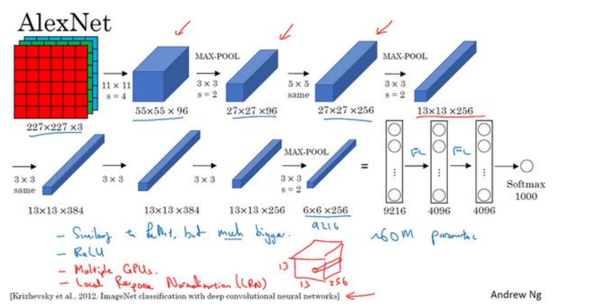
这里我们输入的图片大小是$227 \times 227 \times 3$，在论文中使用的图片大小是$224 \times 224 \times 3$，但是$227 \times 227$会更好。先使用96个$11\times 11$的滤镜，步长为4，得到输出的大小是$55 \times 55 \times 96$，然后做一次最大池化，滤镜大小是$3 \times 3$，步长为2，得到的输出大小是$27 \times 27 \times 96$；接着执行一个$5 \times 5$的卷积，使用padding后的大小是$27 \times 27 \times 256$；再用和前面一样的参数做一次最大池化，图像缩小为$13 \times 13 \times 256$，然后接着做三次卷积，滤镜大小均为$3\times3$，使用相同padding，滤镜个数分别是384，384， 256.得到图像大小是$13 \times 13 \times 256$。再做一次最大池化，参数不变，得到输出为$6 \times 6 \times 256$。把它展成一维的向量，含有9216个元素，全连接两个单元数都是4096的隐藏层，再用1000个单元的softmax层输出。
这种网络与LeNet-5类似，但是包含了多达6000万的参数，性能表现更加优异，而且另外一个表现出色的原因是因为使用了relu激活函数。
在论文中还提到一个“局部响应归一化层”（Local Response Normalization），即 LRN 层，但是应用并不多。基本思路是对网络的一块，如大小是$13 \times 13 \times 256$，我们选取一个位置，对该位置所有通道的256个元素进行归一化。动机是我们可以不需要高激活值的神经元。但是研究者发现，LRN层并不能起太大作用，所以一般不使用。
### VGG
AlexNet网络的一个特点是网络特别复杂，有大量的超参数需要调整。本节介绍的VGG也称为VGG-16则没有那么多的超参数需要调整。VGG-16 网络没有那么多超参数，这是一种只需要专注于构建卷积层的简单网络。首先用 $3×3$，步幅为 1 的过滤器构建卷积层， padding 参数为 same 卷积中的参数。然后用一个$2\times2$，步长为2的过滤器做最大池化。VGG网络的一个优点是简化了网络结构。

假设输入图像是$224\times224\times3$，在开始的两层用64个$3\times3$的过滤器做卷积，padding为Same，得到输出为$224\times224\times64$，然后接上一个池化层将图像缩小为$112\times112\times64$；接着用若干个卷积层，滤镜大小不变，滤镜个数为128，再接一个最大池化层，卷积层后，图像大小保持不变，仍为$112\times112\times128$，池化层后，图像大小为$56\times56\times128$，然后用256个相同的过滤器做三次卷积再池化，然后再卷积三次，再池化。如此几轮操作之后，将得到的$7\times7\times512$展成一维向量，连接两个神经元均为4096的隐藏层，最后连接一个1000个单元的softmax层输出。网络的具体结构如下

VGG-16中的16是指网络包含了16个卷积层和全连接层，参数约为1.38亿个，即使在今天，也属于比较大的网络。但是，网络的结构并不复杂，非常规整。而且卷积层的过滤器数量变化也存在一定的规律，从64到128到256到512，这种结构对研究者非常具有吸引力，但是网络的缺点是训练的参数太多。
有些文章介绍了VGG-19，网络的层数多达19层，需要训练的参数更多，但是实际效果提升并不大，所以很多人仍然使用VGG-16.
## 残差网络（Residual Networks ResNets）
### 残差网络介绍
由于存在梯度消失和梯度爆炸，训练很深的神经网络是一件很难的事情。这里我们学习跳跃连接（Skip connection），它可以从某一层获取激活值，迅速反馈给另外一层，甚至更深层。利用跳跃连接，我们可以构建残差网络，可以帮助我们训练深度超过100层的神经网络。
残差网络是由残差块（Residual block）组成的，所以我们先来了解一下残差块。

在经典的神经网络中，从信息从$a^{[l]}$流到$a^{[l+2]}$只有一条路径，即先经过一个线性变换和非线性的激活函数变成$a^{[l+1]}$，再经过一个线性变换和非线性的激活函数变成$a^{[l+2]}$。
在残差网络中，我们直接把$a^{[l]}$拷贝到深层，如下所示

所以现在计算$a^{[l+2]}$不是$a^{[l+2]}=g(z^{[l+2]})$，而是$a^{[l+2]}=g(z^{[l+2]}+a^{[l]})$，其中$z^{[l+2]}$仍然按照原来的方法计算，只是加上了$a^{[l]}$这个残差块。同样，我们可以把$a^{[l]}$拷贝到更深层。
对于如下的一个普通网络（Plain network）

把它变成残差网络的方法是每两层加一个跳跃连接，构成一个残差块，五个残差块构成一个残差网络

如果我们使用标准的优化算法训练一个神经网络，理论上随着深度的增加，训练误差会不断降低，但是实际上，如果没有残差网络，训练误差会先减小在增加，因为随着深度的增加，优化会越来越困难。
但是有了残差网络就不一样了，即使深度再深，训练的表现仍然不错，如训练深度超过100层时也不例外。这种方法有助于解决梯度消失和梯度爆炸，在训练深度网络的同时，保持良好的性能。也许从另一个角度看，随着网络的加深，网络连接会变得十分臃肿，但是，残差网络在训练深度网络时的确十分有效。
### 残差网络为什么有用
残差网络的一个优点是可以很好地学习恒等函数，如图所示
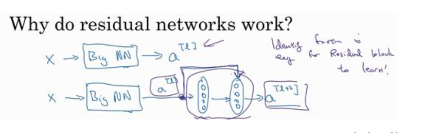
假设我们有一个很深的神经网络，在第$l$和$l+2$层之间添加一个跳跃连接。那么我们得到的$a^{[l+2]}$的输出是$a^{[l+2]}=g(W^{[l+1]}a^{[l+1]}+b^{[l+1]}+a^{[l]})$，如果我们使用L2正则化或者是权重衰减，它会压缩$W^{[l+1]}$的值。如果$W^{[l+2]}=0$，为方便讨论，我们假设$b^{[l+1]}=0$，且我们使用的激活函数都是relu函数，则我们学习到了一个恒等函数$a^{[l+2]}=a^{[l]}$。
所以残差网络可以很容易地学习到恒等函数。即使在一个深度网络中加了两层，如果使用跳跃连接，它的效率也丝毫不会逊色与简单的网络。
当然，如果隐藏层学习到一些有用的信息，那么它可能比学习到恒等函数表现得更好。但是在不含残差块的深度网络中，随着网络的加深，即使是学习恒等函数都很困难，所以很多层最后表现得不是更好，而是更糟糕。
残差网络起的作用主要就是可以很容易地学习恒等函数，可以确定网络的效率至少不会降低，有时候还可以有所提升。
关于残差网络的一个细节是$a^{[l+2]}$和$a^{[l]}$具有相同的维度，因为我们使用了Same卷积。如果输入和输出有不同的维度，比如输入是128，输出是256。这时我们需要一个$128\times256$的矩阵$W_s$，使得$W_sa^{[l]}$是一个256维的向量。这里的$W_s$可以是学习的参数，也可以是固定的矩阵。除了$a^{[l]}$外用0来填充剩余的值。
在残差网络论文中给出了一个普通的网络
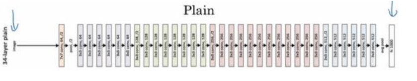
把它转换成残差网络只需要添加跳跃连接即可
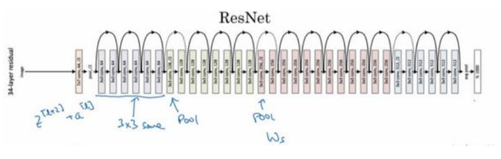
因为使用的都是$3\times3$的卷积层，使用的是Same卷积。 
ResNets 类似于其它很多网络，也会有很多卷积层，其中偶尔会有池化层或类池化层的层。不论这些层是什么类型，正如我们在上一张幻灯片看到的，你都需要调整矩阵$W_s$的维度。普通网络和 ResNets 网络常用的结构是：卷积层-卷积层-卷积层-池化层-卷积层-卷积层-卷积层-池化层……依此重复。 直到最后， 有一个通过 softmax 进行预测的全连接层。
## 网络中的网络及1x1卷积
我们先看一个$1\times1$网络的例子
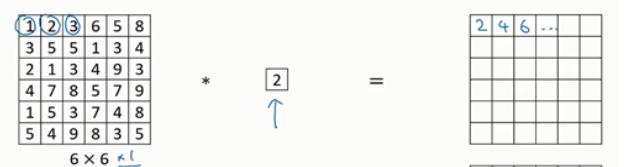
假设图片大小是$6\times6\times1$，过滤器是$1\times1\times1$，数字是2，那么对前三个数做卷积就是把1，2，3乘以2，变成了2，4，6。似乎没什么变化，但是如果增加通道数就不一样了。
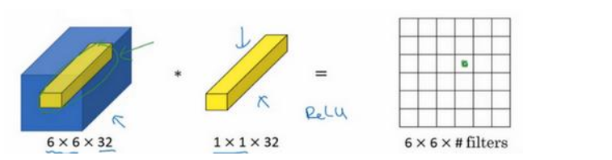
如图所示，如果图片是$6\times6\times32$的，那么过滤器是$1\times1\times32$的，卷积层的功能就是把某个位置通道里的32个数与过滤器的32个数对应相乘再相加，然后用relu函数激活输出。
一般来说，如果过滤器不止一个，而是多个，就好像有多个输入单元，其输入内容为个切片上所有数字，输出是$6\times6\times\mbox{过滤器数量}$。$1\times1$卷积层可以看成是一个全连接层加一个非线性的变换。
这种方法被称为是$1\times1$卷积或者是**Network in Network**，在提出该网络的论文里的网络架构并没有得到广泛应用，但是$1\times1$卷积的理念很有影响力。
$1\times1$卷积的一个应用是可以压缩通道数量，比如一个$28\times28\times192$的图像，可以使用32个$1\times1$的过滤器，把图像压缩为$28\times28\times32$。当然我们也可以保持通道数目不变，但是由于激活函数的存在，它可以学习更为复杂的函数。
## 谷歌Inception网络简介
Inception网络或Inception层的一个特点是可以自行确定使用什么类型的过滤器，以及是否需要池化。一个Inception层如下图所示
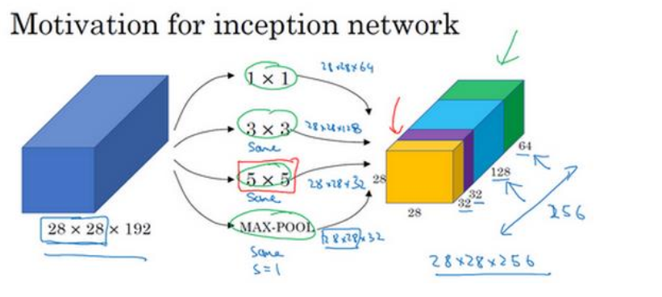
假设输入大小是$28\times28\times192$，我们使用64个$1\times1$过滤器，128个$3\times3$过滤器，32个$5\times5$过滤器，32个最大池化层，然后把结果堆叠在一起，构成一个Inception层，为了使得维度保持一致，我们需要在池化层也是用same padding，最终Inception的输出是$28\times28\times256$。这样，Inception可以自行选择所需要的过滤器类型。
上面描述的Inception网络的一个问题是计算量的问题，我们以$5\times5$的卷积层为例
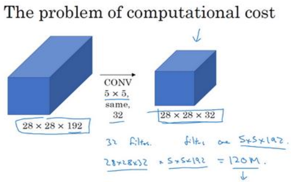
输出大小是$28\times28\times32$，每个数字需要执行$5\times5\times192$次乘法运算，所以做一次卷积大概需要1.2亿次的乘法运算，即使是在现在，这个计算量也是相当大的。使用$1\times1$卷积，我们可以大大减小运算量。
另一种网络架构如下
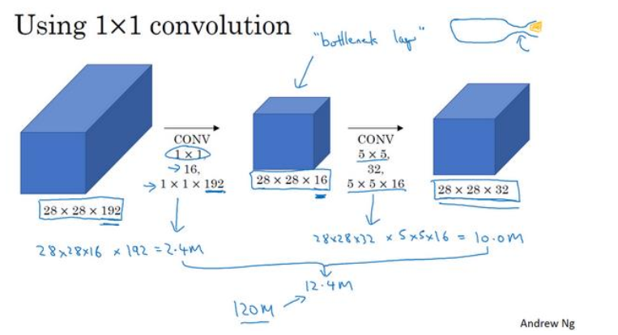
先用16个$1\times1$卷积把通道缩减为16，再使用$5\times5$的卷积。中间这层网络被称为瓶颈层，先把网络缩小再扩大，且事实证明，瓶颈层不会降低网络性能。下面我们来计算所需要的乘法运算量。
第一层大小$28\times28\times16$的输出，每一个需要$1\times1\times192$次乘法，大约为240万；第二层大小$l28\times28\times32$的输出，每一个需要$5\times5\times16$次乘法，大约为1000万，二者相加需要1200万次乘法。计算量降到了原来的十分之一。
所以，如果不知道使用什么类型的过滤器，可以使用Inception层，且用瓶颈层来减小运算量。
一个Inception网络就是把前面讲的Inception模块组合在一起。如下面的一个Inception网络
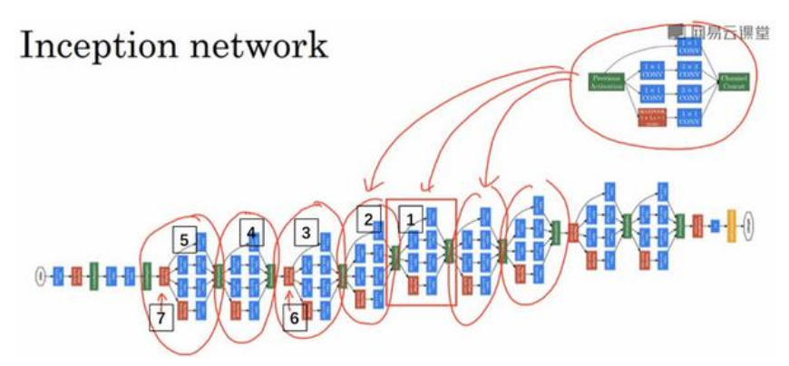
每一个圈住的部分就是一个Inception模块。中间会有一些额外的层（如编号6）是最大池化层来改变图像的大小。
如果阅读论文原文，我们会发现有其他的一些分支
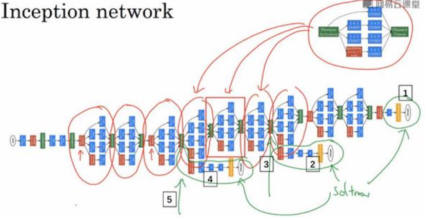
在网络的最后几层是全连接层，再接一个softmax层（如编号1）。编号2其实是通过隐藏层3来做预测，也是一个softmax层。另一个分支（编号4）也是包含了一个隐藏层，通过一些全连接层，通过softmax层来做预测。
这个细节确保了隐藏层和中间单元（编号5）也可以参与特征计算，从而预测图片的分类。起到一种调整的效果，并且可以防止网络过拟合。
## 迁移学习
迁移学习是指在进行一个项目时，寻找类似的开源代码，用别人训练好的权重来帮助我们训练。如进行图像识别，可以在GitHub上寻找ImageNet数据集的识别代码，替换掉softmax层，把前面的层冻结，直接训练最后一层的参数。在很多深度学习框架中，都支持冻结的操作，可以指定训练某一层，从而加速网络的训练。
一个可能有用的技巧是，我们可以提前计算我们的数据集到softmax层前面的激活值并保存下来，这样我们就可以训练一个浅层的神经网络，而不用每一次都计算激活值。
一个规律是，我们拥有的数据集越大，我们需要冻结的层数越少，极端情况是用已经训练好的权重来做初始化。
## 数据扩充
在计算机视觉中，由于需要大量的训练数据，所以，数据扩充是一个经常使用的方法。
常见的一种数据扩充的方法是做垂直镜像对称
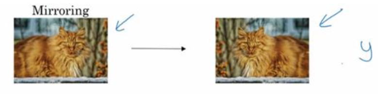
如上图所示，我们要训练一个识别猫的分类器，把一张猫的照片做垂直镜像对称后仍然是一只猫。
另一个技巧是随机裁剪，如下图所示
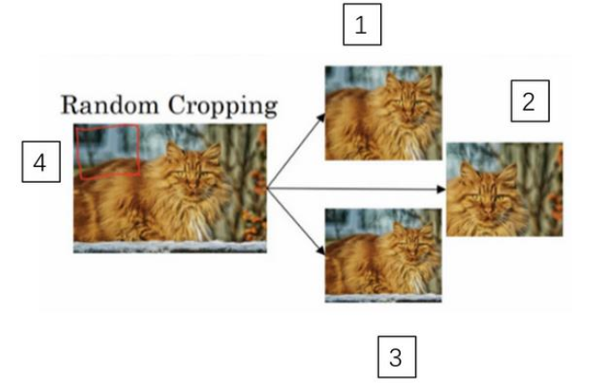
如图，把照片4猫的照片随机裁剪为1,2,3.这种方法可能会使得裁剪得到的照片里不是一只猫，但总体上会帮助我们增加很多训练数据。
另一种方法是色彩转换，给一张图片，在R，G，B三个通道上加上不同的失真值。
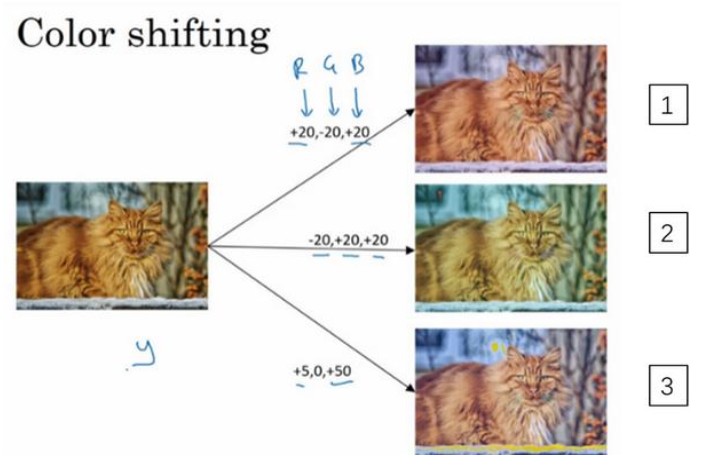
例如在第一张图片中，我们给红色和蓝色通道增加值，给绿色通道减少值。使得整张图片看起来比较偏紫色，这样在训练集中就有失真的图片。第二张和第三张的处理是类似的。使用这种方法，我们的标签是不会改变的，这会使得学习算法对照片颜色改变更具有鲁棒性。
PCA也是一种影响颜色失真的方法。PCA颜色增强是指，如果图片偏紫色，那么PCA 会减小红色和蓝色偏多一点，减小绿色偏少一点，使得整体颜色保持一致。
常用的实现数据扩充的方法是使用一个线程或者是多线程，这些可以用来加载数据，实现变形失真，然后传给其他的线程或者其他进程。
## 计算机视觉现状
我们认为为通常我们的学习算法有两种知识来源，一个来源是被标记的数据，就像$(x,y)$应用在监督学习。第二个知识来源是手工工程，有很多方法去建立一个手工工程系统，它可以是源于精心设计的特征，手工精心设计的网络体系结构或者是系统的其他组件。一直以来计算机视觉都是更多地依赖于手工工程。当没有足够的数据时，手工工程是非常困难的。但是少量数据时，迁移学习是一件有用的事情。
集成学习是一个帮助我们在基准测试中取得优秀表现的一个方法，比如我们可以训练多个神经网络，再对输出进行平均。但是这会消耗大量的时间。所以这是在基准测试和比赛中表现出色的利器，但是很少用来服务客户。
在测试中，一个有用的技巧是**Multi-crop at test time**，这是将数据扩充用于测试集的一种方法。
举个例子，让我们看看猫的图片，然后把它复制四遍，包括它的两个镜像版本。有一种叫作 10-crop 的技术（crop 理解为裁剪的意思），它基本上说，假设你取这个中心区域，裁剪，然后通过你的分类器去运行它，然后取左上角区域，运行你的分类器，右上角用绿色表示，左下方用黄色表示，右下方用橙色表示，通过你的分类器来运行它，然后对镜像图像做同样的事情对吧？所以取中心的 crop，然后取四个角落的 crop
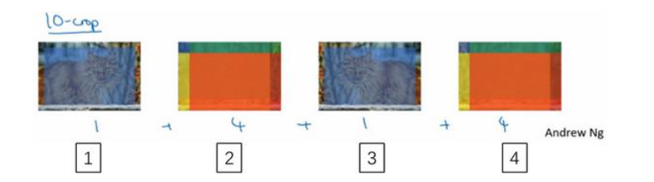
这是这里（编号 1）和这里（编号 3）就是中心 crop，这里（编号 2）和这里（编号 4）就是四个角落的 crop。如果把这些加起来，就会有 10 种不同的图像的 crop，因此命名为 10-crop。所以要做的就是，通过分类器来运行这十张图片，然后对结果进行平均。当然我们也可以使用更多的crop。同样这种方法在基准测试中的应用比实际生产系统中好的多。
集成的一个大问题是你需要保持所有这些不同的神经网络，这就占用了更多的计算机内存。对于 multi-crop，我想你只保留一个网络，所以它不会占用太多的内存，但它仍然会让你的运行时间变慢。
所以，要想建立一个实用的系统，你最好先从其他人的神经网络架构入手。如果可能的话，可以使用开源的一些应用，因为开放的源码实现可能已经找到了所有繁琐的细节，比如学习率衰减方式或者超参数。
